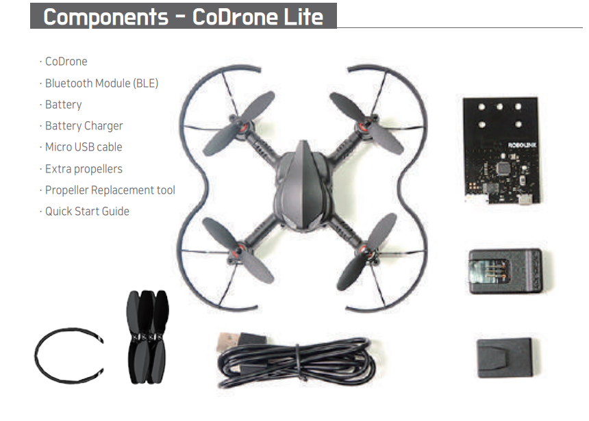
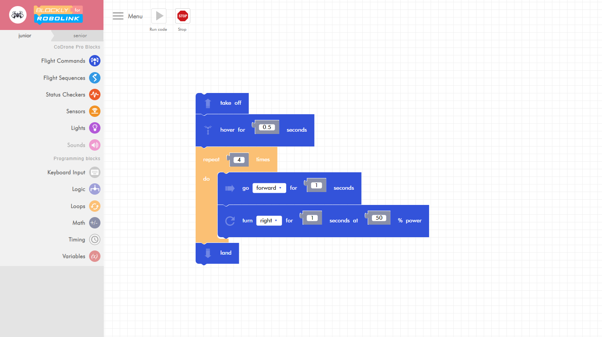

# Using Drones and Block Coding to Teach Basic Programming
## Description
- Difficulty Level: Intermediate  
- Target Audience: Middle School and Up  
- Duration of workshop: Approximately 1 Hour  
- Needed Materials: CoDrone Lite, Computer with bluetooth support.  
- Using CoDrones, the aim of this project is to teach others about basic programming concepts through changing the behavior of the drones with block coding.  
- CoDrones are small and simple drones that are designed to be programmable in various languages including block coding and python.

## Team
### Members  
- Chenanniah Mac-Cephas  
- Phillip Chazares  
- Vi Nguyen  
- Zachary Idrees  

### Advisors  
- Dr. Anca Doloc Mihu  
- Dr. Cindy Robertson  

## Outreach Activities
1. Classroom Workshops on Apr 14, Apr 20, and Apr 20, 2020: workshop demo to 1001 level IT students at GGC, to spark interests in IT and STEM

## Similar Projects

## Technologies
### CoDrone by RoboLink
* https://www.robolink.com/codrone/

### Blockly for CoDrone
* Blockly is a code block editor made for the CoDrone
* https://www.robolink.com/rokit-brick-codrone/

## Project Setup/Installation
1. [Visit Blockly Site](https://codrone.robolink.com/pro/blockly/#)
2. Pair to CoDrone

## Workshop Instructions
For instructions on how to complete our workshop please use the pdf file linked below. 

## Workshop Video
https://github.com/user-attachments/assets/5c1bc88b-43cf-4726-a772-bbca884ad643

## Advanced Workshop Instructions
For instructions on how to complete our advanced workshop please use the pdf file linked below. 

## Advanced Workshop Video
https://github.com/user-attachments/assets/a45d3426-b399-4996-87ee-0c864896dc87

