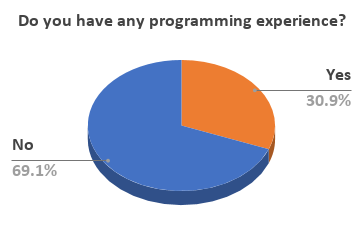
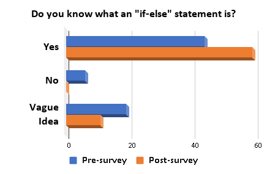
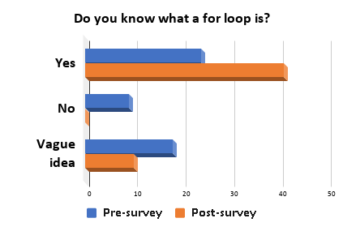
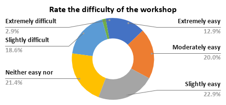
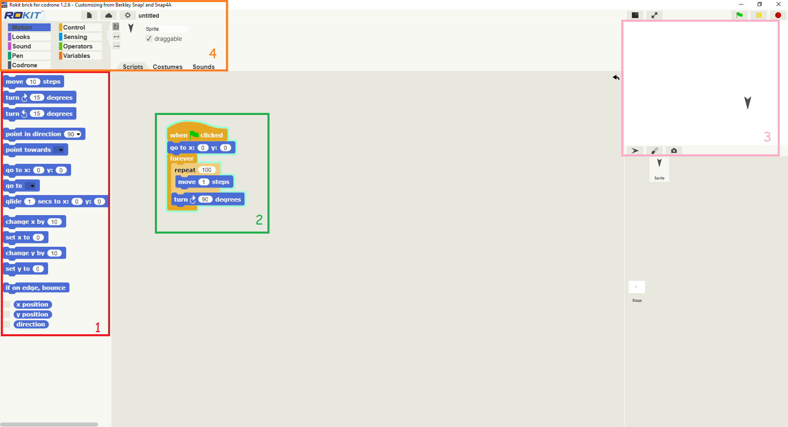

# Drone Reality
## Project Description
The [Technical Ambassador Program](https://www.ggc.edu/academics/schools/school-of-science-and-technology/research-internships-service-learning/technology-ambassador-program/), an Outreach research program to improve technological literacy- in order to engage and teach students about new technologies and algorithmic thinking. Normally students would see code as unknown text that is too difficult to read which will turn most them away from coding before giving it a chance. However, coding is fun and with Drones we can show students how fun coding really is. Being able to fly drones however they like will give them tons of creative freedom. They will be able to have fun trying out different coding techniques with block coding and the best part is that they can easily see what their code does with the drone app RoKitBrick for Codrone. The app can connect with actual drones as well so if they happen to have a drone flying them is possible with the app. 
* [Having Fun and Learning through Drones](https://www.youtube.com/watch?v=VeJIbEyXcyA&feature=youtu.be)
* [Flying a drone through a hoop](https://www.youtube.com/watch?v=11Bljd7Lohs)
### Team

## Spring 2020
***

* Team Name: DroneReality
1.  **Vi Nguyen**
2.  **Phillip Chazares**
3.  **Chenanniah Mac-Cephas**
4.  **Zachary Idrees**
  
  
* Team Name: DroneReality
1. **Anca Doloc Mihu** - Assistant Professor of Information Technology
2. **Cindy Robertson** - Assistant Professor of Information Technology

## Outreach Activities
Classroom Workshops - on April 14, April 20, and another on April 20 3 occasions, to promote IT field to non-IT college students

## Results
### Demographics & Pre-Survey Results: 
Our study was conducted with 68 college students, the majority consisting of Sophomores and Juniors between the ages  18-23. In the beginning of our workshop 69% of students had no programming experience. Over 50% of students reported they had no or vague knowledge what a for loop is. While strangely, 64.7% reported had knowledge what an if else statement was. Originally there was no indication whether or not students wanted to learn technology.
### Post-Survey & Conclusions: 
Outstandingly after the workshop 86.8% and 77.1% of students reported that they knew if/else statements and for loops. After the workshop 84% of students indicated they would consider or would pursue learning new technologies. In conclusion, we were able to teach fundamental programming skills and inspire a large demographic of students with no programming skills to consider seeking out information technology courses.

  

 
 

  

## Technologies
### CoDrone by RoboLink
* https://www.robolink.com/codrone/

### RokitBrick for CoDrone
* RokitBrick is an IDE made for the CoDrone, it includes a Drone simulation
* https://www.robolink.com/rokit-brick-codrone/

## Project Setup/Installation
1. Download RokitBrick for CoDrone
  * http://robolink.co.kr/download_eng.html

## Usage

1. This window contains motion coding blocks that can be dragged and dropped in box 2.
2. This is a programming script used to control the arrow pointer in box 3.
3. This window contains the area of movement for the programmable arrow pointer.
4. This window contains coding tabs to changing box 1 and contains tabs for RokitBrick settings.
