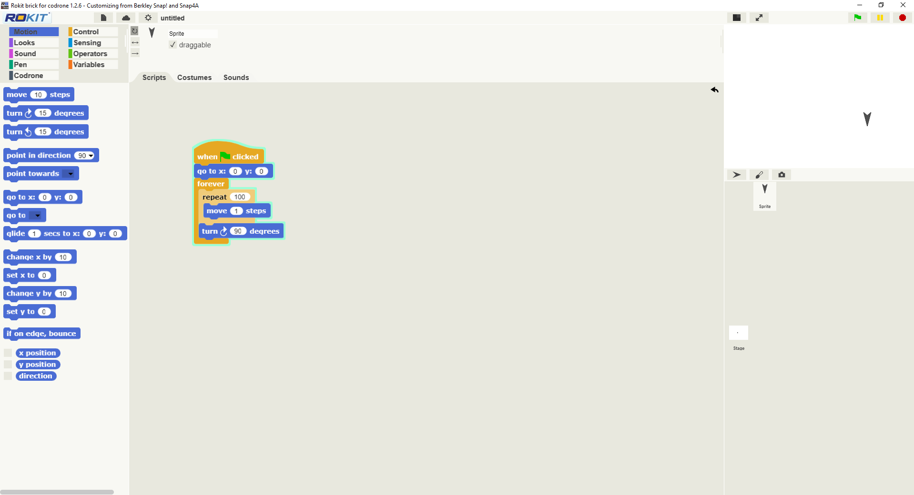

# Drone Reality
The [Technical Ambassador Program](https://www.ggc.edu/academics/schools/school-of-science-and-technology/research-internships-service-learning/technology-ambassador-program/), an Outreach research

### Team

## Spring 2020
***

* Team Name: DroneReality
1.  **Vi Nguyen**
2.  **Phillip Chazares**
3.  **Chenanniah Mac-Cephas**
4.  **Zachary Idrees**
  
  
* Team Name: DroneReality
1. **Anca Doloc Mihu** - Assistant Professor of Information Technology
2. **Cindy Robertson** - Assistant Professor of Information Technology

## Publications: 

## Outreach Activities
Classroom Workshops - on April 14, April 20, and another on April 20 3 occasions, to promote IT field to non-IT college students

## Technologies
* CoDrone by RoboLink
* https://www.robolink.com/codrone/

## Project Setup/Installation
1. Download RokitBrick for CoDrone
* http://robolink.co.kr/download_eng.html

## Usage

1. 
2. 
3. 
4. 
